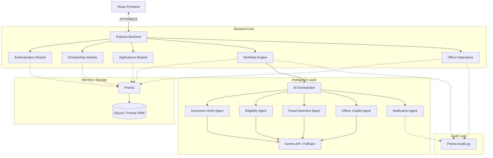

# ScholarFlow AI — System Architecture

This document describes the architecture, data models, and agent workflows for **ScholarFlow AI**, an agent-driven business process automation platform for scholarship governance.

## System Architecture



---

## Technical Stack

| Layer | Selected Tech | Rationale |
| :--- | :--- | :--- |
| **Backend Framework** | Node.js + Express | Fast, asynchronous, handles file streams and micro-services effortlessly. |
| **Database ORM** | Prisma Client | Type-safe queries, migration system, and declarative schema models. |
| **Database engine** | SQLite | Serverless, file-based database for zero-config demonstration and fast local/CI testing. |
| **AI Integration** | `@google/generative-ai` | Official Google SDK for low-latency calls to Gemini 1.5 Flash. |
| **Auth** | JSON Web Tokens (JWT) + bcryptjs | Standard security configuration for stateless API endpoints. |
| **Testing** | Jest + Playwright | Unit testing API controllers and ensuring web-server responsiveness in CI. |

---

## Data Models

ScholarFlow AI utilizes Prisma ORM. Below are the key data models defined in [`schema.prisma`](file:///c:/Users/KIIT/_WORKSPACE_/ScholarFlow%20AI/backend/prisma/schema.prisma):

- **User**: Details of students and officer logins (role matches `STUDENT` or `OFFICER`).
- **Scholarship**: Defines criteria (min CGPA, max family income, category constraints) and sanction amounts.
- **Application**: The core entity tracking academic records, bank data, status (`DRAFT`, `SUBMITTED`, `OFFICER_REVIEW`, `APPROVED`, etc.), and workflow progress.
- **Document**: Individual attachments (`AADHAAR`, `INCOME_CERTIFICATE`, `MARKSHEET`) with OCR records and verification flags.
- **AgentResult**: Raw logs from individual agent executions (verifications, duplicate tests, copilot reports) saved in structured JSON.
- **AuditLog**: Traceability system tracking timestamps, events, actors, and detailed outcomes.
- **Notification**: Alert alerts pushed to students on dashboard status changes.

---

## Process Workflow

```
[DRAFT] --> Student uploads Aadhaar, Income certificate & Marksheet
   ↓
[SUBMITTED] --> Student locks and submits application
   ↓
[DOCUMENT_VERIFICATION] --> OCR Agent extracts fields; Doc Agent verifies integrity
   ↓
[ELIGIBILITY_CHECK] --> Eligibility Agent compares applicant details against scholarship rules
   ↓
[FRAUD_DETECTION] --> Fraud Agent runs cross-application sweeps for duplicate credentials
   ↓
[OFFICER_REVIEW] --> Copilot Agent synthesizes data; queues application for Officer check
   ↓
[APPROVED] / [REJECTED] --> Officer reviews and acts; Notification Agent updates applicant
```
